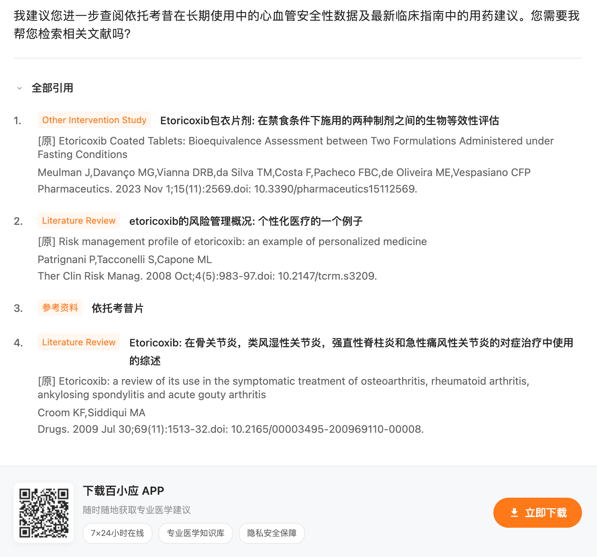

# @baichuan-ai/baixiaoying-mcp-server

百小应医学大模型 MCP Server —— 已支持 **MCP 协议最新 Feature [MCP APPs](https://modelcontextprotocol.io/docs/extensions/apps)**，提供可视化的回答内容，体验完全对标百川官方 APP [百小应](https://ying.ai/)。


## 为什么选择百小应 MCP Server？

### 🏆 SOTA 医学大模型

Baichuan-M3-Plus 是百川智能推出的**最低幻觉循证增强医疗大模型**，在权威医学评测中表现卓越：

| 指标                 | 表现                                                                    |
| -------------------- | ----------------------------------------------------------------------- |
| **幻觉率**           | 基准测试仅 **2.6%**，大幅领先行业                                       |
| **HealthBench**      | 超越 OpenAI GPT-5.2，达到 SOTA                                          |
| **HealthBench-Hard** | 得分 44.4，超越 GPT-5.2                                                 |
| **SCAN-bench**       | 唯一在 Clinical Inquiry、Laboratory Testing、Diagnosis 三项同时排名第一 |
| **成本**             | 相比上一代模型**降低 70%**                                              |

### 🧬 核心技术优势

- **六源循证系统** - 首创证据锚定技术，回答严谨可追溯，有效抑制幻觉
- **临床问诊思维** - 模型底层具备临床医生的问诊思维与循证思维，支持 SCAN-Driven Clinical-Grade Systematic History Taking
- **高保真临床问诊** - High-Fidelity Clinical Inquiry，将问诊过程重构为临床级别、结构化、可审计的信息生成流水线

### 🧩 MCP APPs 协议

已支持 MCP 最新协议 **MCP APPs**，输出可视化内容，效果与百小应官方 APP 完全对齐：




## 功能特性

- 🖥️ **可视化回答** - 输出可视化内容，效果与百小应官方 APP 对齐
- 🩺 **医学问答对话** - 使用专业医学大模型回答健康相关问题
- 📄 **文档问答** - 上传医学文档进行智能问答
- 📚 **证据引用** - 回答附带专业文献引用
- 🧠 **思考过程** - 展示模型的推理思考步骤

## 🎁 海纳百川计划


百川正式推出「海纳百川」计划，**面向所有为医务工作者提供服务的机构，免费提供循证增强的 M3-Plus API**。

### 参与条件

| 项目         | 说明                                                                       |
| ------------ | -------------------------------------------------------------------------- |
| **适用对象** | 为医务工作者提供服务的机构（医生、药剂师、医技师、护士、健管师、医学生等） |
| **适用场景** | 临床辅助决策、医学教育                                                     |
| **用途限制** | 仅用于真实服务场景，不得用于数据生产                                       |
| **使用要求** | 产品需明确展示 Powered by 百川，不得对模型输出进行影响准确性的修改         |

👉 [立即申请](https://www.baichuan-ai.com/home)

## 支持的模型

| 模型             | 说明                     |
| ---------------- | ------------------------ |
| Baichuan-M3-Plus | 最新医学大模型，推荐使用 |
| Baichuan-M2-Plus | 医学大模型               |

## 学术与资源

- 🏠 **百川官网**：https://www.baichuan-ai.com/home
- 📖 **学术报告**：https://www.baichuan-ai.com/blog/baichuan-M3
- 💻 **M3 Github**：https://github.com/baichuan-inc/Baichuan-M3-235B
- 🤗 **M3 Model**：https://huggingface.co/baichuan-inc/Baichuan-M3-235B
- ⚡ **M3 GPTQ-4bit**：https://huggingface.co/baichuan-inc/Baichuan-M3-235B-GPTQ-INT4

## 快速开始

### 安装

```bash
npm install @baichuan-ai/baixiaoying-mcp-server
```

### 环境变量

| 变量名             | 必填 | 说明                                                                    |
| ------------------ | ---- | ----------------------------------------------------------------------- |
| `BAICHUAN_API_KEY` | 是   | 百川 API Key，从 [百川开放平台](https://platform.baichuan-ai.com/) 获取 |

### Claude Desktop 配置

在 `claude_desktop_config.json` 中添加：

```json
{
  "mcpServers": {
    "baixiaoying": {
      "command": "npx",
      "args": ["-y", "@baichuan-ai/baixiaoying-mcp-server"],
      "env": {
        "BAICHUAN_API_KEY": "your-api-key-here"
      }
    }
  }
}
```

或者使用本地安装：

```json
{
  "mcpServers": {
    "baixiaoying": {
      "command": "node",
      "args": ["/path/to/baixiaoying-mcp-server/dist/index.js"],
      "env": {
        "BAICHUAN_API_KEY": "your-api-key-here"
      }
    }
  }
}
```

## 可用工具

### baixiaoying_chat

使用百小应大模型进行医学问答对话。

**参数：**

| 参数             | 类型     | 必填 | 默认值             | 说明                       |
| ---------------- | -------- | ---- | ------------------ | -------------------------- |
| `message`        | string   | 是   | -                  | 用户输入的问题             |
| `model`          | string   | 否   | "Baichuan-M3-Plus" | 模型选择                   |
| `file_ids`       | string[] | 否   | -                  | 文件 ID 列表，用于文档问答 |
| `temperature`    | number   | 否   | 0.3                | 采样温度 (0-1)             |
| `evidence_scope` | string   | 否   | "grounded"         | 证据范围                   |

**示例：**

```
使用百小应问一下"小儿感冒咳嗽，痰咳不出来怎么办？"
```

### baixiaoying_upload_file

上传医学文档用于后续的文档问答。

**支持的文件格式：** pdf, doc, docx, txt, html, md, csv, png, jpg 等

**参数：**

| 参数        | 类型   | 必填 | 说明         |
| ----------- | ------ | ---- | ------------ |
| `file_path` | string | 是   | 本地文件路径 |
| `file_name` | string | 否   | 自定义文件名 |

### baixiaoying_list_files

获取已上传的文件列表。

### baixiaoying_get_file_status

查询文件的解析状态。

**状态说明：**

- `init` - 待解析
- `parsing` - 解析中
- `online` - 解析成功，可以使用
- `fail` - 解析失败
- `unsafe` - 未通过安全检查

### baixiaoying_delete_file

删除指定的已上传文件。

## 使用示例

### 基础对话

```
问百小应：高血压患者日常需要注意什么？
```

### 文档问答

```
1. 先上传文档
2. 查询文件状态，等待变为 online
3. 使用 baixiaoying_chat 工具，传入 file_ids 参数进行问答
```

## 开发

```bash
# 安装依赖
pnpm install

# Node 版本要求（最低 LTS）
# Node.js >= 18

# 构建
pnpm build

# 开发模式
pnpm dev

# 启动
pnpm start
```

## 许可证

MIT
